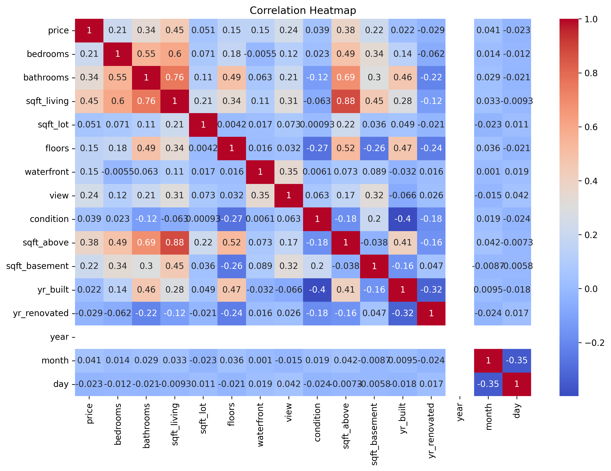
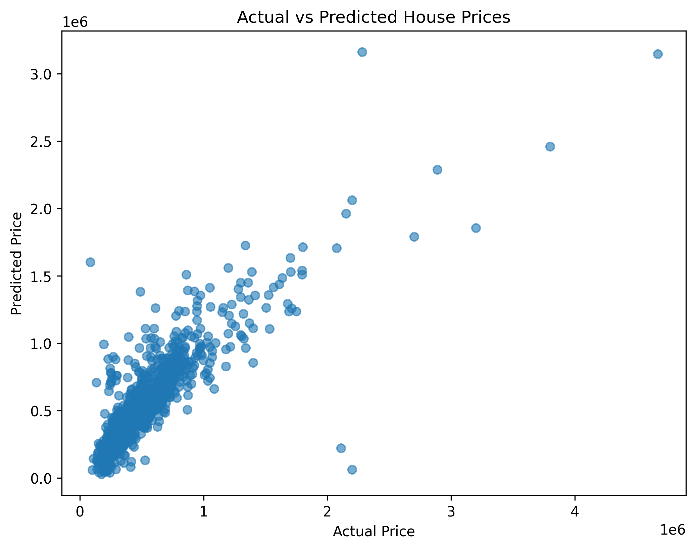
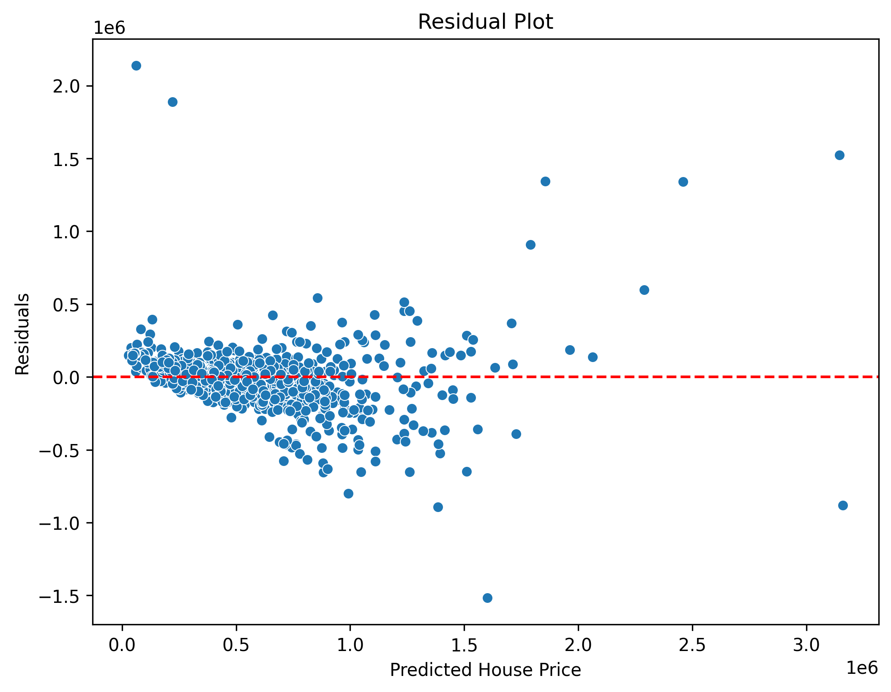

# House Price Prediction Model
A Machine Learning project built using **Python** and **Scikit-learn** to predict house prices based on various property features. This project demonstrates the complete machine learning workflow, including data preprocessing, feature engineering, model training, evaluation, and visualization.

## Project Overview
The goal of this project is to build a **Linear Regression** model that predicts the selling price of a house using features such as:

Number of bedrooms
- Number of bathrooms
- Living area
- Lot size
- Number of floors
- Waterfront
- View
- Condition
- Year built
- Year renovated
- City
- State ZIP

This project is a beginner-friendly implementation of supervised machine learning using **Scikit-learn**.

## Features

- Exploratory Data Analysis (EDA)
- Data Cleaning
- Duplicate Removal
- Missing Value Handling
- Feature Engineering
- One-Hot Encoding
- Feature Scaling
- Train-Test Split
- Linear Regression Model
- Model Evaluation
- Data Visualization

## Techstack

- Python
- Pandas
- NumPy
- Matplotlib
- Seaborn
- Scikit-learn

## Model Used

**Linear Regression**

Linear Regression is a supervised machine learning algorithm used to predict continuous numerical values by finding the best-fit linear relationship between independent variables and the target variable.

## Model Evaluation Metrics

The model was evaluated using:

- Mean Absolute Error (MAE)
- Mean Squared Error (MSE)
- Root Mean Squared Error (RMSE)
- R² Score (Coefficient of Determination)

# Visualizations

The project includes the following visualizations:

- Correlation Heatmap
- Actual vs Predicted Prices

## Correlation Heatmap

## Actual Price vs Predicted Prices

## Reidual Graph

# Author

B.Tech Computer Science Engineering (AI & ML)

Passionate about Artificial Intelligence, Machine Learning, Python, and building real-world projects.